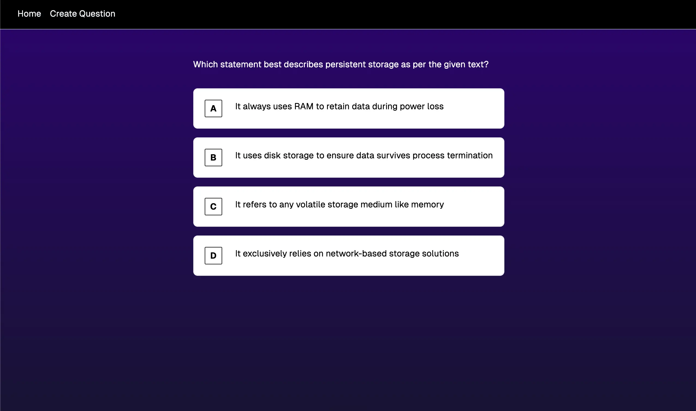
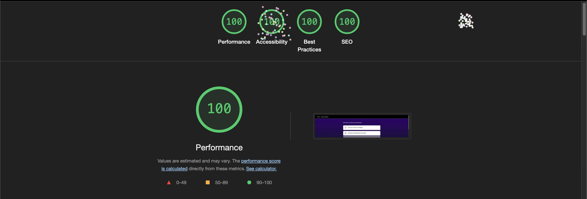

  
  

    

# Welcome to Frontend Quiz
This is a multiple-choice quiz generator to help you study computer science topics. You can create multiple-choice questions and test your knowledge by solving questions in your question bank.

## The Stack 🧰

This app is built using [create-t3-app](https://github.com/t3-oss/create-t3-app_), which includes:

-   Next.js 15
-   TypeScript
-   Tailwind CSS
-   Drizzle

## Command Cheat Sheet

All commands are run from the root of the project, from a terminal.

| Command                | Action                                           |
| :--------------------- | :----------------------------------------------- |
| `npm install`          | Installs dependencies                            |
| `npm run dev`          | Starts local dev server at `localhost:3000`      |
| `npm run build`        | Build your production site to `./dist/`          |

## Lighthouse Scores

    

